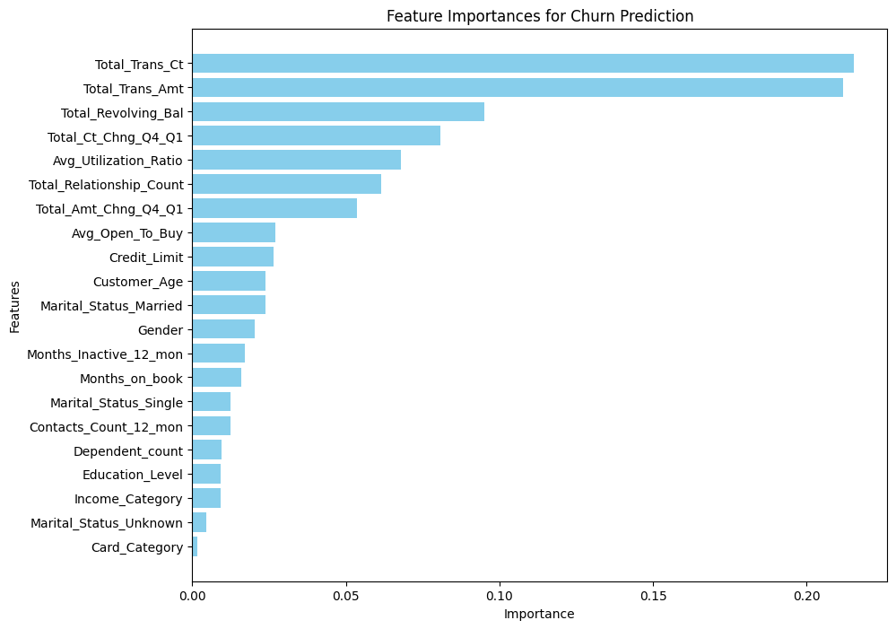

# Bank Customer Churn Prediction

This repository contains a series of Jupyter notebooks and Python scripts used to predict customer churn for a bank. The models explore different machine learning techniques to analyze customer behavior and identify potential churners.

## ⚠️ **Data Sources**

The data utilized in this project is sourced from Kaggle's [Credit Card Customers](https://www.kaggle.com/sakshigoyal7/credit-card-customers).

## 📂 Repo Structure

```
├── data
│ ├── BankChurners.csv
│ ├── BankChurners_preprocessed.csv
│ 
├── 1. preprocessing.ipynb
├── 2.1 KNN.ipynb
├── 2.2 logistic regression.ipynb
├── 2.3 decision tree.ipynb
├── 2.4 random forest.ipynb
├── 3. Clustering.ipynb
├── main.py
├── model comparison.py
├── README.md
├── requirements.txt

```


## 🔧 Installation
Install the required libraries:

   - [](https://python.org)
   - [](https://pandas.pydata.org/)
   - [](https://numpy.org/)
   - [](https://matplotlib.org/)
   - [](https://seaborn.pydata.org/)
   - [](https://scikit-learn.org/stable/)

For implementation with custom data, clone the repository and follow the instructions detailed in the `requirements.txt` file.


## 📝 Data Description

The datasets contain various features related to customer behavior and demographic information, which are used to predict the likelihood of a customer leaving the bank. The preprocessing.ipynb notebook details the steps to clean and prepare the data. 


### Preprocessing Data

The dataset named `BankChurners.csv`, provided by the client from Kaggle, underwent significant preprocessing. Key steps included:
- Dropping three columns as advised by the client: the last two columns and the client number column, which were irrelevant for the analysis.
- Handling 'Unknown' values appropriately based on the chosen modelling approach to maintaining data integrity.
- Employing label encoding to transform categorical string values into integers, facilitating effective model training.


## 🚀 Model Performance Metrics

Each model notebook (2.1 to 2.4) details specific machine learning techniques, with model comparison.ipynb providing a comprehensive comparison of their performance.

The following table summarizes the performance of various models evaluated in this project. Metrics reported include Accuracy, Precision, Recall, F1-Score, and ROC AUC.

| Model                | Accuracy | Precision | Recall  | F1-Score | ROC AUC |
|----------------------|----------|-----------|---------|----------|---------|
| KNN                  | 0.901    | 0.905     | 0.901   | 0.901    | 0.949   |
| Decision Tree        | 0.951    | 0.951     | 0.951   | 0.951    | 0.951   |
| Logistic Regression  | 0.815    | 0.815     | 0.815   | 0.815    | 0.897   |
| Random Forest        | 0.979    | 0.979     | 0.979   | 0.979    | 0.998   |

These metrics were calculated using a hold-out validation method where the dataset was split into training and test sets. The ROC AUC scores provide insight into the models' ability to distinguish between classes.
``

## Comparison models by ROC-curve


## Feature importance
This highlights the features that have the most significant impact on the model's performance.



Here are the features ranked by their importance in predicting churn, as determined by the Random Forest model:
- Total_Trans_ct (21.55%): Total Transaction Count
- Total_Trans_Amt (21.2%): Total Transaction Amount
- Total_Revolving_Bal (9.51%): Total Revolving Balance on the Credit Card
- Total_Ct_Chng_Q4_Q1 (8.08%): Change in Transaction Count from Q4 to Q1
- Avg_Utilization_Ratio (6.79%): Average Card Utilization Ratio
- Total_Relationship_Count (6.14%): Number of Products held by the customer
- Total_Amt_Chng_Q4_Q1 (5.36%): Change in Transaction Amount from Q4 to Q1
- Avg_Open_To_Buy (2.69%): Available Credit Line
- Credit_Limit (2.66%)

These features contribute significantly to the model's ability to predict whether a customer will churn or not. The most impactful features are related to transaction behavior and credit utilization, which are critical indicators of customer engagement and satisfaction.

## ⏰ Timeline

This project was completed within a timeframe of 5 working days.


